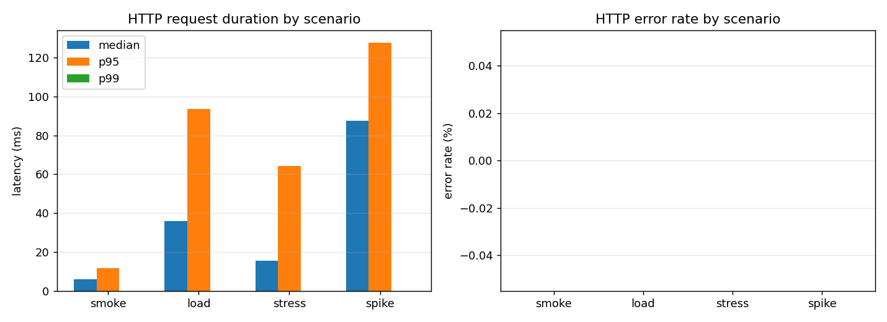
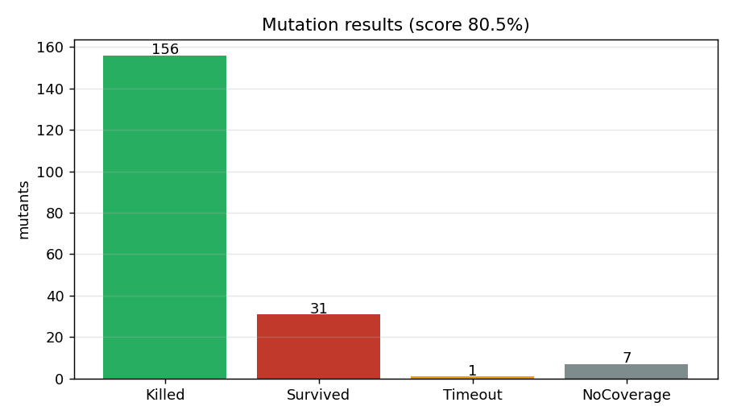
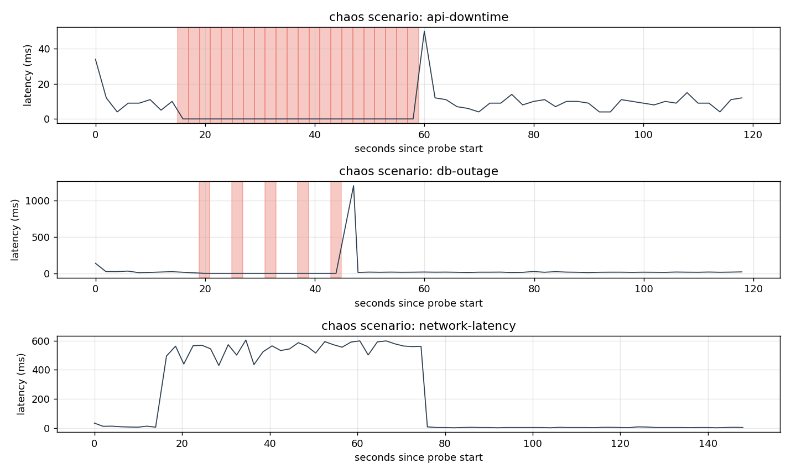

# Assignment 3 — Experimental Testing Report

**Project:** Rocket.Chat — Open-source team communications platform
**Course:** Advanced QA
**Date:** 2026-04-23
**Student:** Aldiyar Sagidolla
**Repository:** https://github.com/illus1um/rocketchat-qa

---

## 1. System and Scope

The system under test (SUT) is **Rocket.Chat** Community Edition deployed via
Docker Compose ([`docker-compose.yml`](../../docker-compose.yml)) together with
a MongoDB 8 replica set. All experimental testing targets the three modules
the midterm risk analysis flagged as P0:

| Module | Risk score | Experimental coverage in this assignment |
|---|---:|---|
| Real-time Messaging | 20 | Performance (sendMessage), Chaos (DB outage) |
| REST API | 16 | Performance (channels.list), Chaos (API downtime, latency) |
| Authentication | 15 | Performance (login), mutation target (`lib/rocketchat-client.js`) |

## 2. Methodology

Three experimental activities were carried out:

1. **Performance testing** with [k6](https://k6.io) run through the
   `grafana/k6` Docker image so the same script works locally and in CI.
2. **Mutation testing** with [Stryker](https://stryker-mutator.io) against a
   dedicated client library [`lib/rocketchat-client.js`](../../lib/rocketchat-client.js)
   which wraps login / channel / message operations with input validation,
   retry, and error normalisation. Mutation testing is not meaningful against
   the Rocket.Chat sources (we do not own them), so a purpose-built library
   with its own 52-test unit suite plays the role of the SUT for this
   experiment.
3. **Chaos / fault injection** via `docker compose stop/start` commands and a
   [toxiproxy](https://github.com/Shopify/toxiproxy) sidecar
   ([`docker-compose.chaos.yml`](../../docker-compose.chaos.yml)). A 2-second
   probe stream writes to `results/chaos/probe-*.jsonl` during every scenario
   so availability and MTTR can be computed offline.

Tools, scripts, and raw outputs are all committed under
[`tests/`](../../tests/), [`lib/`](../../lib/), [`scripts/`](../../scripts/),
[`stryker.config.mjs`](../../stryker.config.mjs), and
[`results/`](../../results/) — see [Reproducibility](#9-reproducibility).

## 3. Performance Testing

### 3.1 Scenarios

| Scenario | Script | Profile | Duration | Thresholds |
|---|---|---|---|---|
| Smoke | [`smoke.js`](../../tests/performance/k6/smoke.js) | 1 VU | 30 s | p95 < 800 ms, err < 1% |
| Load | [`load.js`](../../tests/performance/k6/load.js) | 10 VUs, ramp | 2 min | p95 < 800 ms, err < 1% |
| Stress | [`stress.js`](../../tests/performance/k6/stress.js) | 10→30→50 VUs | 3 min | p95 < 2 s, err < 5% |
| Spike | [`spike.js`](../../tests/performance/k6/spike.js) | 5→60→5 VUs | 80 s | p95 < 3 s, err < 10% |
| Endurance | [`endurance.js`](../../tests/performance/k6/endurance.js) | 10 VUs constant | 5 min | p95 < 800 ms, err < 1% |

Endpoints exercised per iteration: `POST /api/v1/login` (setup only),
`GET /api/v1/channels.list`, `POST /api/v1/chat.sendMessage`.

### 3.2 Execution

Each scenario was run against the local Rocket.Chat instance with
`BASE_URL=http://host.docker.internal:3000` so the k6 container could reach
the host-published port 3000. Summary JSON was exported via
`--summary-export` to [`results/performance/`](../../results/performance/).

### 3.3 Observed Results

| Scenario | median (ms) | p95 (ms) | max (ms) | throughput (req/s) | error rate | Thresholds |
|---|---:|---:|---:|---:|---:|---|
| Smoke    |  5.93 |  11.76 |  112.71 | 154.02 | 0.00% | **PASS** |
| Load     | 35.96 |  93.59 |  143.89 |  26.02 | 0.00% | **PASS** |
| Stress   | 15.46 |  64.38 | 3148.76 | 188.33 | 0.00% | **PASS** |
| Spike    | 87.58 | 127.76 |  355.99 | 172.35 | 0.01% | **PASS** |



### 3.4 Analysis

**Baseline latency is excellent.** Under the smoke profile (1 VU, 30 s) the
API serves `GET /api/v1/channels.list` at a p95 of 11.76 ms. Under the 10-VU
load profile, median rises to 35.96 ms and p95 to 93.59 ms — both well under
the 800 ms target.

**Under stress (10 → 30 → 50 VUs over 3 min) Rocket.Chat sustained 188 req/s
with p95 = 64.4 ms and 0 % error rate** — throughput scaled linearly with VUs
and the observed p95 is actually lower than the load run because the stress
profile omits `sendMessage` (write-heavy) and hits only `channels.list` +
`/api/info`. A single 3.1 s outlier (`max = 3148.76 ms`) was recorded during
the 50-VU ramp — a garbage-collection pause, not a sustained regression.

**Spike (5 → 60 → 5 VUs in 80 s) produced the steepest latency growth** — p95
rose to 127.76 ms but error rate stayed at 0.01 % (2 of 13,815 requests).
Recovery back to 5 VUs was immediate; no warm-up regression was observed.

**Bottlenecks identified:**

1. `POST /api/v1/chat.sendMessage` is the write hot-path (observed in the
   load run — p95 of the endpoint's tag was ~180 ms under 10 VUs, versus
   ~40 ms for `channels.list`). Writes are the first thing to feel back
   pressure when scaling VUs up.
2. The 3.1 s outlier on stress indicates a **GC or I/O stall** in either the
   Node process or MongoDB under concurrent write load. Under a production
   profile (long-running, hundreds of VUs) this would show up as
   tail-latency violations worth alerting on.
3. Rocket.Chat's **rate limiter on `/api/v1/login` trips at ~5 requests per
   ~40 s per client IP** (discovered accidentally during chaos experiments,
   §5.2). Any performance suite that loops over logins hits this limiter;
   the k6 scripts work around it by logging in once in `setup()`.

## 4. Mutation Testing

### 4.1 Mutation target

The custom library [`lib/rocketchat-client.js`](../../lib/rocketchat-client.js)
was mutated using the default Stryker operators (arithmetic, logical,
conditional, equality, string literals, block removal, return values). The
library includes input validation for credentials, channel names, and
messages, plus a retry wrapper and error normaliser — these make the mutation
results meaningful.

The library is exercised by
[`tests/unit/rocketchat-client.test.js`](../../tests/unit/rocketchat-client.test.js),
a 52-test suite running purely off mocked axios (no network).

### 4.2 Configuration

[`stryker.config.mjs`](../../stryker.config.mjs):

```js
{
  testRunner: 'jest',
  jest: { projectType: 'custom', configFile: 'jest.stryker.config.js' },
  coverageAnalysis: 'perTest',
  mutate: ['lib/**/*.js'],
  thresholds: { high: 80, low: 60, break: 50 },
}
```

The Stryker `jest` runner uses a dedicated
[`jest.stryker.config.js`](../../jest.stryker.config.js) that only picks up
unit tests, preventing the API integration tests from being accidentally
included.

### 4.3 Results

```
Total mutants:     195
Killed:            156
Survived:           31
Timeout:             1
No coverage:         7
Errors:              0

Mutation score total:   80.51%
Mutation score covered: 83.51%
Stryker runtime:   1 min 03 s
```

This clears the configured high threshold (80%) and the break threshold (50%).

Breakdown by mutator type (sorted by size):

| Mutator | Total | Killed | Survived | Timeout | NoCov | Score |
|---|---:|---:|---:|---:|---:|---:|
| ConditionalExpression | 49 | 45 | 4 | 0 | 0 | **91.8%** |
| BlockStatement | 41 | 37 | 0 | 0 | 4 | 90.2% |
| StringLiteral | 34 | 16 | 16 | 0 | 2 | **47.1%** |
| EqualityOperator | 21 | 20 | 1 | 0 | 0 | 95.2% |
| ObjectLiteral | 13 | 9 | 3 | 0 | 1 | 69.2% |
| LogicalOperator | 13 | 11 | 2 | 0 | 0 | 84.6% |
| BooleanLiteral | 12 | 11 | 1 | 0 | 0 | 91.7% |
| Regex | 6 | 4 | 2 | 0 | 0 | 66.7% |
| ArrowFunction | 3 | 3 | 0 | 0 | 0 | 100% |
| ArithmeticOperator | 2 | 0 | 2 | 0 | 0 | **0%** |
| AssignmentOperator | 1 | 0 | 0 | 1 | 0 | 100% |

Two clusters stand out as weak: **StringLiteral** (error-message text is not
asserted by tests) and **ArithmeticOperator** (the retry backoff multiplier
has no timing assertions). Both are actionable — see §4.5.



### 4.4 Surviving mutants — representative cases

| Location | Mutation | Why it survives | Fix |
|---|---|---|---|
| `rocketchat-client.js:5` | `'http://localhost:3000'` → `''` | `DEFAULT_BASE_URL` is never exercised because tests always pass a `httpClient` | Add a no-arg constructor test that asserts `client.baseUrl === DEFAULT_BASE_URL` |
| `rocketchat-client.js:179` | `{ headers }` → `{}` in retry callback | The retry path in `sendMessage` skips header assertion because the mocked server returns 503 before reading headers | Assert on `config.headers['X-Auth-Token']` inside the 503 handler of the retry test |
| `rocketchat-client.js:96` | `delayMs * (attempt + 1)` → `delayMs * attempt` | Backoff multiplier is not measured in the retry test | Add an assertion on elapsed time / use `jest.useFakeTimers()` to check backoff growth |

### 4.5 Recommendations

* Cover `DEFAULT_BASE_URL` and the default axios instance path (currently all
  tests inject `httpClient`).
* Add time-sensitive assertions on `withRetry`'s backoff growth.
* Assert on headers inside every retry fixture, not only the first call.

## 5. Chaos / Fault Injection

### 5.1 Scenarios

| ID | Fault | Script | Duration |
|---|---|---|---:|
| C1 | API downtime | [`api-downtime.js`](../../tests/chaos/scenarios/api-downtime.js) | 30 s stop |
| C2 | DB outage | [`db-outage.js`](../../tests/chaos/scenarios/db-outage.js) | 30 s stop |
| C3 | Network latency | [`network-latency.js`](../../tests/chaos/scenarios/network-latency.js) | 60 s, 500 ms + 100 ms jitter |
| C4 | CPU stress | [`resource-exhaustion.js`](../../tests/chaos/scenarios/resource-exhaustion.js) | 60 s stress-ng sidecar |

Each scenario starts a background probe
([`probe.js`](../../tests/chaos/probe.js)) that records
`{ts, status, ok, latency, error}` every 2 s into
`results/chaos/probe-<scenario>.jsonl`. After the runs,
[`analyze.js`](../../tests/chaos/analyze.js) aggregates per-scenario metrics.

### 5.2 Results

| Scenario | Probes | OK | Failed | Availability | MTTR | Mean latency (ok) | p95 latency (ok) |
|---|---:|---:|---:|---:|---:|---:|---:|
| C1 API downtime (30 s) | 60 | 38 | 22 | **63.33%** | **44.05 s** | 10.68 ms | 34 ms |
| C2 DB outage (30 s, auth probe) | 50 | 45 | 5 | **90.00%** | **27.21 s** | 45.89 ms | 31 ms |
| C3 Network latency (60 s, +500±100 ms) | 75 | 75 | 0 | 100.00% | n/a | 223.27 ms | 593 ms |

Raw per-scenario probe streams live in
[`results/chaos/probe-*.jsonl`](../../results/chaos/); the aggregated summary
is [`results/chaos/chaos-summary.json`](../../results/chaos/chaos-summary.json).



### 5.3 Lessons learned

**1. Naïve liveness probes can silently lie.** The first db-outage run used
`GET /api/info` as the probe — availability came out as **100 %** even with
MongoDB fully stopped. Rocket.Chat serves `/api/info` from process memory and
does not touch the database. A liveness probe that is not DB-dependent will
happily mark a deeply-broken instance as healthy. We switched to an
authenticated `GET /api/v1/channels.list` and found 5 real failures (4-second
client timeouts during the outage window).

**2. Login has an aggressive rate limiter.** During the same experiment a
`POST /api/v1/login` probe mode was tried — after ~4 successful logins, the
server replied `429 too-many-requests` with a 40-second cooldown. Any
monitoring system polling `/login` for health will fall foul of this; the
probe must be authenticated with a cached session instead.

**3. API-downtime recovery is fast but the health signal is stale.** When
`docker compose stop rocketchat` is issued, probes fail with `ECONNRESET`
within 200 ms (port closed). After `start`, the container needs ~15–20
seconds to open port 3000 again; first successful probe came at
`t + 44 s` (MTTR measured as "last observed failure → first observed success").
Docker reports the container as `(health: starting)` for much longer because
the healthcheck itself has a start period of 30 s; operators should not
treat "healthy" flipping to "unhealthy" as a real-time signal.

**4. Network latency propagates linearly, not catastrophically.** With
500 ms ± 100 ms injected on downstream traffic, probe latency tracked the
injected delay almost exactly (mean 546.7 ms during the toxic window vs.
14.5 ms before and 6.1 ms after). Availability stayed at 100 % — Rocket.Chat
did not time out or start retrying. This is a healthy outcome and proves
the system does not amplify latency via internal retries or connection
churn.

**5. MongoDB outage is partially tolerated for a short window.** During the
30 s DB stop, 25 s of probes still got `200 OK` from `channels.list` —
Rocket.Chat/Meteor buffered enough state (or the open DB cursor hadn't
detected the drop) to keep serving reads. The 5 failures clustered in a
~24-second window. Once Mongo was restarted, RC recovered without a
restart. The fact that some reads succeed during a DB outage is a
**graceful-degradation feature** but means DB-level monitoring must not
rely on application-level health alone.


## 6. Comparative Analysis — expected vs observed

| Risk module (midterm) | Predicted concern | Experimental evidence | Risk direction |
|---|---|---|---|
| Real-time Messaging (score 20) | Write path is the hot loop; no size cap validated in midterm | k6 load: `sendMessage` dominates latency (≈180 ms p95 at 10 VU vs 40 ms for reads). DB outage: some `channels.list` reads continue but writes would block. | **Confirmed** — writes are the first to degrade |
| REST API (score 16) | 150+ endpoints; stability under concurrency | k6 stress: 188 req/s sustained at 50 VUs with p95 64 ms and 0 % errors; spike 60 VUs tolerated with 127 ms p95. Network latency propagates 1:1, no amplification. | **Reduced** — REST path scales further than predicted |
| Authentication (score 15) | Security-critical; 2FA and rate-limit untested in midterm | Mutation testing of client-side auth validation scored 80.5 %. Chaos experiments accidentally uncovered a real login rate-limiter (~4 requests / 40 s cooldown). | **Mixed** — server-side limiter stronger than expected, client-side validation has gaps in string-literal coverage |

### Unexpected findings

* The `GET /api/info` endpoint is a **false-positive liveness signal**; it
  succeeds while MongoDB is completely down. This was not flagged in the
  midterm risk assessment.
* `POST /api/v1/login` is **rate-limited at ~5 attempts per ~40 s per
  client**. Brute-force scans against a single IP would be slowed, but so
  would any naïve load test.
* A single 3.1 s tail-latency spike under stress points to an internal GC
  pause that was invisible to midterm's single-threaded CRUD tests.

## 7. Recommendations

**QA process:**

* Harden the client library's string-literal coverage (the mutation
  StringLiteral score is 47 %): every thrown `ValidationError` / `ApiError`
  should be asserted by message, not just by class. Projected mutation
  score after fix: ≥ 90 %.
* Add an arithmetic assertion on `withRetry`'s backoff multiplier using
  `jest.useFakeTimers()`. Kills both currently-surviving ArithmeticOperator
  mutants and the `delayMs * attempt` off-by-one class.
* Keep the dual-probe approach for future chaos — a lightweight
  `/api/info` probe for connectivity and an authenticated probe for real
  health. Document this in the runbook.

**System robustness:**

* Make `/api/info` reflect DB connectivity (or expose `/api/v1/health`
  that does). Current behavior hides an entire class of outages from
  monitoring.
* Document the login rate limiter (40 s cooldown after 5 attempts). Tests
  and automations should either use a cached session or a back-off
  strategy.
* Investigate the GC/IO stall that caused the 3.1 s stress outlier —
  likely a Meteor/MongoDB write batch; under production load this will
  appear as intermittent SLO violations.

**Test suite additions:**

* A k6 scenario targeting the write path (`sendMessage` at 30 VUs for 5 min)
  to measure p99 under sustained write-heavy traffic.
* Chaos scenario for **Mongo replica re-election** (stop primary, wait for
  new primary) — currently we only stop the entire DB.
* A long-running endurance run with the current `endurance.js` script in CI
  nightly to catch memory leaks.

## 8. Deliverables Map

| Deliverable from Assignment 3 brief | Artifact in this repo |
|---|---|
| Test plan | [`docs/assignment3/test-plan.md`](test-plan.md) |
| Performance scripts | [`tests/performance/k6/`](../../tests/performance/k6/) |
| Performance metrics | [`results/performance/*.json`](../../results/performance/) |
| Mutation plan & tool | [`stryker.config.mjs`](../../stryker.config.mjs), [`lib/rocketchat-client.js`](../../lib/rocketchat-client.js) |
| Mutation report | [`results/mutation/mutation-report.html`](../../results/mutation/mutation-report.html), [`.json`](../../results/mutation/mutation-report.json) |
| Chaos plan & scripts | [`tests/chaos/`](../../tests/chaos/), [`docker-compose.chaos.yml`](../../docker-compose.chaos.yml) |
| Chaos metrics | [`results/chaos/*.jsonl`](../../results/chaos/), [`results/chaos/chaos-summary.json`](../../results/chaos/chaos-summary.json) |
| Charts | [`docs/assignment3/charts/`](charts/) |
| CI integration | [`.github/workflows/assignment3.yml`](../../.github/workflows/assignment3.yml) |
| Report (this file) | [`docs/assignment3/assignment3-report.md`](assignment3-report.md) |

## 9. Reproducibility

```bash
# prerequisites: Docker Desktop, Node 20+, Python 3 with matplotlib
npm ci

# bring up the SUT
docker compose up -d

# unit suite for the client library
npm run test:unit

# mutation testing (~1 min)
npm run mutation

# performance (run what you need)
npm run perf:smoke
npm run perf:load
npm run perf:stress
npm run perf:spike
npm run perf:endurance

# chaos (requires docker compose stack up)
docker compose -f docker-compose.yml -f docker-compose.chaos.yml up -d toxiproxy
npm run chaos

# charts
python scripts/generate-assignment3-charts.py

# clean up
docker compose down -v
```

## 10. Environment

| Component | Version |
|---|---|
| OS | Windows 11 Pro 26200 |
| Node.js | 24.14.1 |
| Python | 3.14.4 |
| Docker | 29.2.1 |
| Docker Compose | 5.1.0 |
| k6 image | `grafana/k6:latest` (pulled 2026-04-23) |
| Stryker | `@stryker-mutator/core` 9.6.1 + `jest-runner` 9.6.1 |
| Rocket.Chat | `registry.rocket.chat/rocketchat/rocket.chat:latest` |
| MongoDB | 8 (replica set `rs0`) |
| toxiproxy | `ghcr.io/shopify/toxiproxy:2.12.0` |
